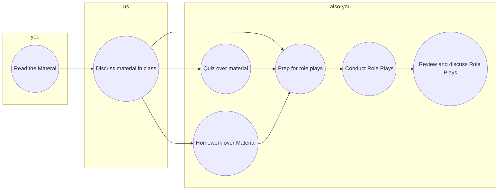

# Chapter 1 Lecture Notes
## How to suceed in class


## Review of basic ideas
### Economics
+ All humans want things
  + We have infinite desires
  + But have limited means to aquire those things 
  + Prioritize
  + ```I have 10$ but I want to go out ot eat and a movie (probably not both)```
  + How to decide
    + Tradeoffs/Deferred Gratification (Deny outselves now for bigger goal)
+ Macroeconomics
  + Economics on a top down scale
    + World
    + Country
    + Region
    + Firm
+ Microeconomics
  + Bottom Up Scale
  + From Person to firm
### Macroeconomic Structures
+ Capitalism
  + Individuals own **and control** means of production
    + Labor
    + Capital
    + Tools
+ Socialism
  + Governments/Collectives control means of productions
    + Ownership and Control are different things

```Advanced economies exist on a spectrum of Capitalism and Socialism```

### Point of firms
+ Core functions
  + Produce something
  + Market that something
+ Every other function is supporting
  + Support core functions but firms can't exist without them
+ Why
  + Generate :dollar: for owners
### Marketing
+ Anybody who engauges in ____ are marketers
  + buying
  + selling
  + grading
  + financing
  + risk taking
  + gathering info
+ They follow their guiding philosopy (marketing concept) to **facilitate** exchange
+ Marketing is demphasized as a society becomes more socialistic
  + Less choice
```We exist in an era where a marketing concept is guiding philosophy for managers```
### Marketing concept
+ To be successful focus all efforts on taking care of your customers while satisfying profit
  + Product of trial and error
  + First outcroppings of civilization

+ Magers have four tools to facilitate exchange
  + Product
    + Developing an appropriate offering
  + Price
    + Exchange requirements
  + Place
    + Location of customers
  + Promotion
    + Communicating with customers
      + Personal
        + Professional selling
  
  ## Professional Selling
  ### What is Professional Selling?
  + Help customers choose and use right product
  + Short term
    + Help customers accomplish what they are tyring to do
  + Med/Long term
    + Build a business relationship


